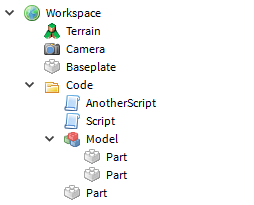

# Elixir

Compiles Lua source code into a ROBLOX-compatible XML file that can be easily
imported into your game.

Elixir is best for someone that prefers to work outside of ROBLOX Studio,
where you can leverage the power of a version control system and your favorite
text editor.

## Getting Started

All you need is Python 3.4+ and you're good to go. You can install Elixir by
simply running the setup script.

```bash
$ python setup.py install
```

Elixir can be run in two ways. From the command line:

```bash
# Displays all of the arguments and options that you need to know about.
$ elixir -h
```

Or with a Python script:

```python
# build.py
from elixir.compilers import ModelCompiler

source = "src/"
dest = "model.rbxmx"

compiler = ModelCompiler(source, dest)
compiler.compile()
```

Running the `elixir` command lets you compile models quickly and easily, but if
you have a lot of options you want to pass in, it can be beneficial to create a
script like the above that you simply run with `python build.py`.

## Compilers

Compilers are what take care of constructing the model file. They're the
backbone of Elixir that brings everything together. Compilers and the command
line are the primary interfaces to Elixir.

### elixir.compilers.ModelCompiler

This is Elixir's primary compiler. It converts folders, Lua files, and ROBLOX
models into a file that you can import into your game.

This allows you to keep your codebase separate from your ROBLOX level. When
you're ready to apply your code changes, you compile it into a model and drag it
into your game.

**Parameters:**

- **_source_**: The directory containing Lua code and ROBLOX Models that you
  want compiled.

- **_dest_**: The name of the file that will be created when compiling.

  Directories in this path are automatically created for you. For example, if
  you set this to `build/model.rbxmx`, the `build/` directory will be created if
  it doesn't already exist.

  It's important that the file extension should either be `.rbxmx` or `.rbxm`.
  Those are the two filetypes recognized by ROBLOX Studio. You won't be able to
  import the file into your game otherwise.

- **_processor=BaseProcessor_**: The processor to use when compiling. A
  processor is what handles files and folders as the compiler comes across them.
  It dictates the type of ROBLOX class is returned.

## Properties

When working with Elixir, there is no Properties panel like you would find in
ROBLOX Studio. To make up for this, properties are defined using inline comments
at the top of your Lua files.

```lua
-- Name: HelloWorld
-- ClassName: LocalScript

local function hello()
  return "Hello, World!"
end
```

When compiled, this would create a LocalScript named `HelloWorld`.

List of properties:

- **Name**: Any alphanumeric string can be used for the name (defaults to the
  file name).
- **ClassName**: This can be any one of ROBLOX's Script instances (defaults to
  `Script`).
- **Disabled**: Controls the Script's in-game `Disabled` property. You can set
  this to `true` or `false`.

## Modules

Any Lua file with a `return` statement at the end of the file is assumed to be a
ModuleScript when compiling.

This means you generally won't have to bother with setting properties at the top
of the file. One of the few cases where it's needed is when creating
LocalScripts.

## Importing Models

ROBLOX model files inside of the source directory will be automatically imported
when compiling.

**This only applies to files with the extension `rbxmx`.** That's the XML
variant of ROBLOX's models. The other is `rbxm`, which is the binary format.
Any model file in your source directory must be in XML if you want it to be
imported.

The contents of the model are unpacked to the current folder in-game when the
compiler comes across them. The model file itself does not act as a folder. For
example, if you had a project setup like this on your computer:

```
src/
  Code/
    AnotherScript.lua
    Script.lua
    Model.rbxmx
```

And the in-game contents of `Model.rbxmx` were:


It would look like this in-game:



## Processors

A processor is what the compilers use to determine what happens when they
encounter a file or folder. They're easy to extend and allow you to process
your source code in any way you want.

You can make use of an existing processor with the `--processor` flag on the
command line:

```bash
$ elixir src/ model.rbxmx --processor NevermoreProcessor
```

Or by passing the processor into the compiler:

```python
from elixir.compilerss import ModelCompiler
from elixir.processors import NevermoreProcessor

source = "src/"
dest = "model.rbxmx"

compiler = ModelCompiler(source, dest, processor=NevermoreProcessor)
compiler.compile()
```

Be sure to read over everything a processor does so you don't get caught off
guard.

### elixir.processors.BaseProcessor

This is the default processor class that Elixir uses. All other processors
should inherit from it.

- All folders are compiled to ROBLOX `Folder` instances.
- All Lua files are compiled to ROBLOX `Script` instances.
- All ROBLOX XML models are unpacked at their position in the hierarchy. See
  [Importing Models](#importing-models) for more details.

### elixir.processors.NevermoreProcessor (Legacy)

**NevermoreEngine no longer requires a custom processor.** This is kept for
legacy support. The last version supported by this processor can be found
[here](https://github.com/Quenty/NevermoreEngine/tree/b9b5a8).

A processor for [NevermoreEngine](https://github.com/Quenty/NevermoreEngine), a
project by Quenty to help you structure your game.

- Overrides `model_name` to `Nevermore`. Nevermore internally references itself
  at `ServerScriptService.Nevermore`, so we need to ensure it's going by the
  correct name, otherwise it will error.
- `NevermoreEngineLoader.lua` is compiled to a `Script`, and is the only one
  that will be enabled.
- `Scripts` and `LocalScripts` will be disabled.
- All other Lua files will be compiled into `ModuleScripts`.
